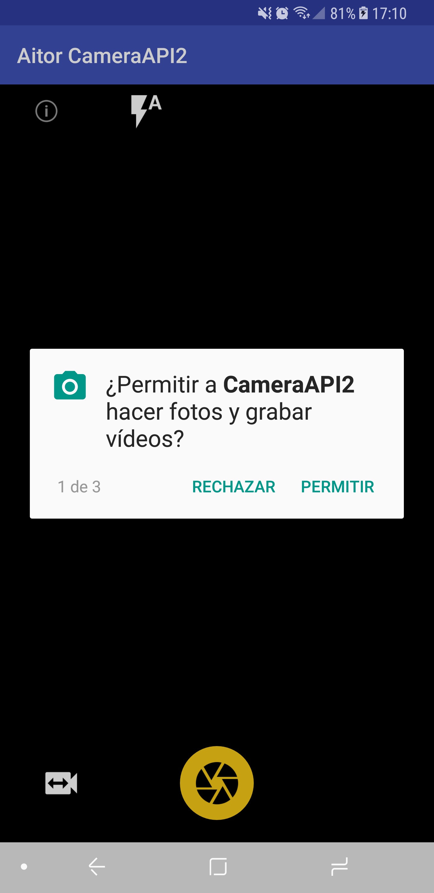
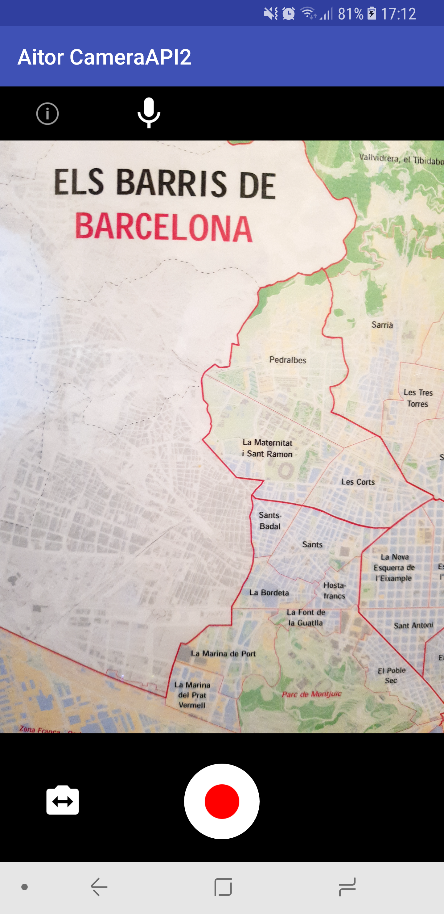

# CameraAPI2
[](https://github.com/arodriguezq/CameraAPI2)

Aplicació destinada a l'entendiment de la [Camera API 2](https://developer.android.com/reference/android/hardware/Camera.html) per capturar imatges i vídeos de manerera senzilla i integrar-ho en casos d'ús reals. En cap cas és permés l'ús d'aquest projecte fora de l'àmbit educatiu.

**Nota:** Aquest porjecte pren com a referència els exemples de Google [Android Camera2Basic](https://github.com/googlesamples/android-Camera2Basic) per a l'apartat fotogràfic i [Android Camera2Video](https://github.com/googlesamples/android-Camera2Video) per a l'apartat de vídeo.

## Instal·lació i configuració
Utilitzant Android Studio 3.0 o superior descàrregar el projecte en local, ja sigui directament amb clone o fen prèviament fork. El projecte incorpora tot lo necessari per funcionar en qualsevol dispositiu amb Android API 21 o superior.  
És possible que en la primera execució aparegui un error relacionat amd l'Android SDK. En aques cas assegurar-se que la `compileSdkVersion` i la `buildToolsVersion` de l'arxiu Gradle siguin de la mateixa versió:

```xml
android {
    compileSdkVersion 26
    defaultConfig {
        applicationId "iam48032574.escoladeltreball.org.cameraapi2"
        minSdkVersion 21
        targetSdkVersion 26
        versionCode 1
        versionName "1.0"
        testInstrumentationRunner "android.support.test.runner.AndroidJUnitRunner"
    }
    buildTypes {
        release {
            minifyEnabled false
            proguardFiles getDefaultProguardFile('proguard-android.txt'), 'proguard-rules.pro'
        }
    }
    buildToolsVersion '26.0.2'
}
```
## Utilització
Primerament l'aplicació demanará sempre els permisos en cas de no tenir-los.



Un cop acceptat els permissos cal prémer el botó central groc per capturar les imatges. La ruta per defecte on s'emmagatzemen els arxius és `/Pictures/CameraAPI2`.  
En cas de polsar el botó de l'esquerra en forma de càmera vídeo s'accedeix a la pantalla de grabació de vídeos.



De la mateixa manera que amb la pantalla de fotos, en la pantalla de vídeos, per poder capturar un vídeo cal prémer el botó central (blanc i vermell). Al fer-ho el cercle canvia a quadrat per indicar que s'ha iniciat la grabació. Per finalitzar només cal prémer de nou el botó i el vídeo es guardarà a la carpeta anteriorment mencionada.  
D'altra banda, si el que es dessitja es tornar a la pantalla de captura d'imatges és tan fàcil com polsar el botó de l'esquerra amb forma de càmera de fotos.

### Aclaracions
L'aplicació pren les imatges i vídeos respectant la relació d'aspecte tant en posició vertical com horitzonal. No té zoom ni bloqueig del focus ni el flash com tampoc pot deshabilitar el silenci en la grabació de vídeo.  

Per resoldre dubtes: -Un 7?-
- Sol·licitut de permissos: PhotoFragment.java L:625
- Nom d'imatge dinàmic: PhotoFragment.java L:947
- Funcionalitat dels botons: PhotoFragment L:909

- Nom de vídeo dinàmic: VideoFragment.java L:613
- Funcionalitat dels botons: VideoFragment.java L:306

Llicència
-------
Per herència de Google Samples.  

Licensed to the Apache Software Foundation (ASF) under one or more contributor
license agreements.  See the NOTICE file distributed with this work for
additional information regarding copyright ownership.  The ASF licenses this
file to you under the Apache License, Version 2.0 (the "License"); you may not
use this file except in compliance with the License.  You may obtain a copy of
the License at

http://www.apache.org/licenses/LICENSE-2.0

Unless required by applicable law or agreed to in writing, software
distributed under the License is distributed on an "AS IS" BASIS, WITHOUT
WARRANTIES OR CONDITIONS OF ANY KIND, either express or implied.  See the
License for the specific language governing permissions and limitations under
the License.
